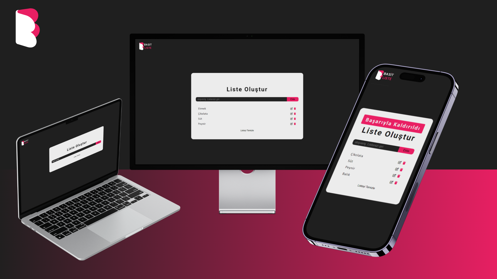
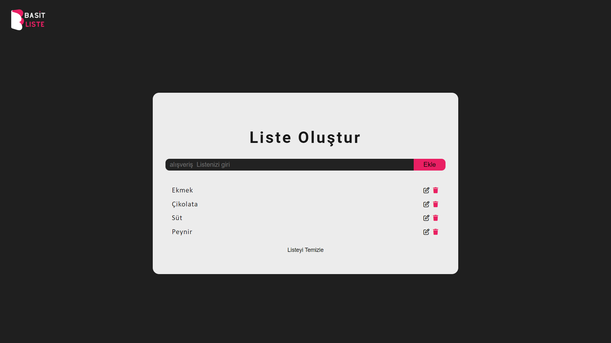

# Basit Liste

    

## Açıklama
Bu proje, kullanıcıların listeler oluşturmasını, listelere öğe eklemesini ve çıkarmasını sağlayan bir web uygulamasıdır. Ayrıca, kullanıcının tüm listeyi tek bir düğmeyle silebilmesini sağlayan bir özellik içermektedir. Uygulama tamamen duyarlıdır, yani farklı cihazlarda sorunsuz çalışır.

## Özellikler
- Kullanıcılar liste oluşturabilir, düzenleyebilir ve silebilir.
- Liste öğeleri ekleyebilir ve çıkarabilir.
- Tüm listeyi tek bir düğmeyle silme özelliği.
- Eklenen veya çıkarılan öğeler için anlık geri bildirim sağlayan alert mesajları.

## Teknolojiler
- HTML
- CSS (Tamamen responsive)
- JavaScript (ES6+)

## Nasıl Kullanılır
1. Web tarayıcınızda projenin URL'sini açın.
2. Ana sayfada, "Yeni Liste Oluştur" düğmesine tıklayarak yeni bir liste oluşturun.
3. Oluşturulan liste üzerinde "Ekle" düğmesine tıklayarak liste öğelerini ekleyin.
4. Listeden öğe çıkarmak için, öğenin yanındaki çıkartma (çöp kutusu) düğmesine tıklayın.
5. Tüm listeyi silmek için "Listeyi Temizle" düğmesine tıklayın.

## Ekran Görüntüleri

## İletişim
Eğer herhangi bir sorunuz veya geri bildiriminiz varsa, lütfen halidduman60@gmail.com adresinden bana ulaşın.

---

